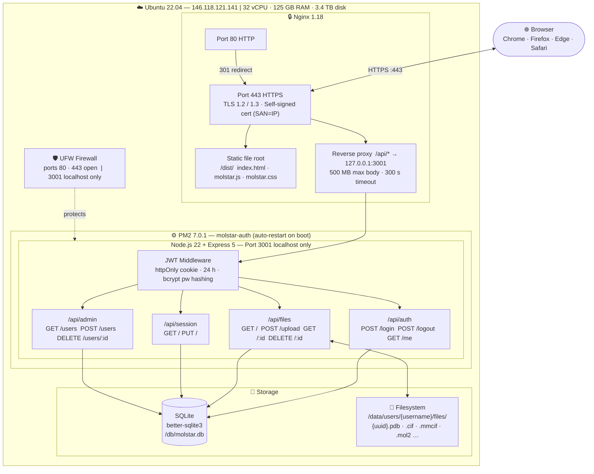
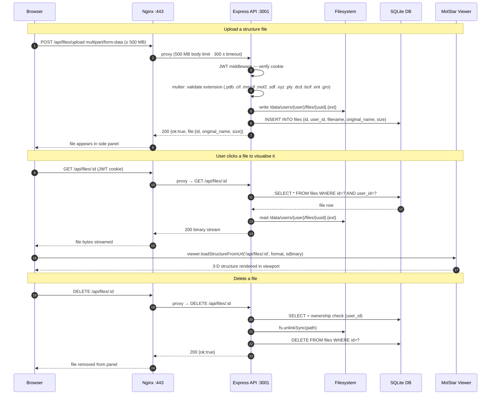
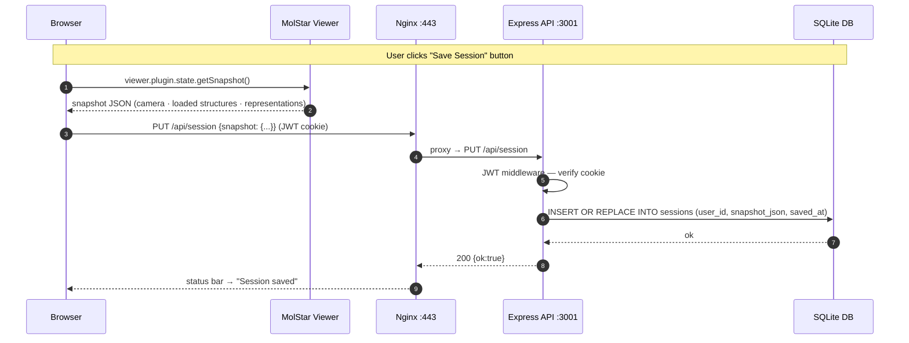
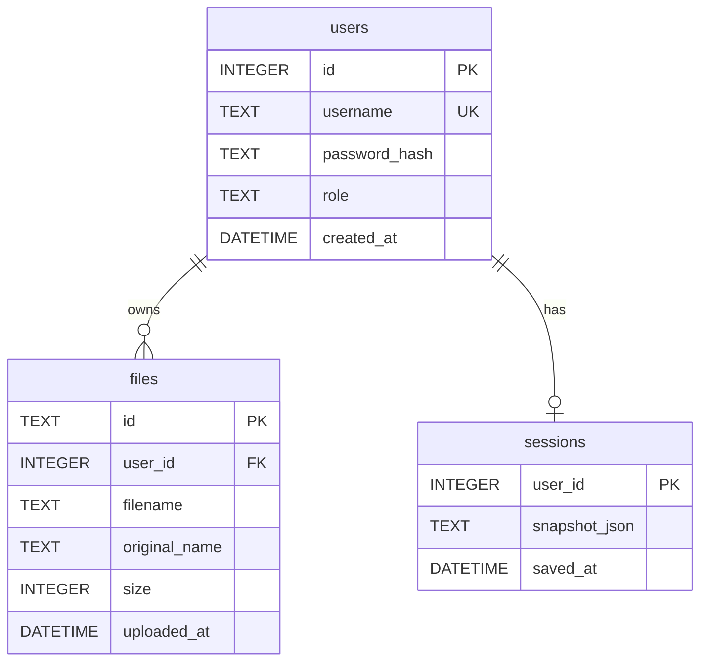

# MolStar Server — Architecture & Flow

> **Live instance:** `https://146.118.121.141` (accept self-signed cert)  
> **Stack:** Nginx 1.18 · Node.js 22 · Express 5 · SQLite · MolStar 5.9.0 · PM2

---

## 1 · System Architecture



---

## 2 · Authentication & Session Startup Flow

```mermaid
sequenceDiagram
    autonumber
    participant B as Browser
    participant N as Nginx :443
    participant A as Express API :3001
    participant D as SQLite DB

    Note over B,D: Page load — check existing session
    B->>N: GET / (HTTPS)
    N-->>B: 200 index.html + molstar.js

    B->>N: GET /api/auth/me (no cookie yet)
    N->>A: proxy → GET /api/auth/me
    A-->>N: 401 Not authenticated
    N-->>B: 401 → show login modal

    Note over B,D: User submits credentials
    B->>N: POST /api/auth/login {username, password}
    N->>A: proxy → POST /api/auth/login
    A->>D: SELECT * FROM users WHERE username = ?
    D-->>A: user row with password_hash
    A->>A: bcrypt.compare(password, hash)
    A-->>N: 200  Set-Cookie: token=JWT; HttpOnly; Secure; SameSite=Strict; Max-Age=86400
    N-->>B: 200 + JWT cookie (24 h) → hide modal, show viewer

    Note over B,D: App initialises — restore last saved session
    B->>N: GET /api/session (JWT cookie attached)
    N->>A: proxy → GET /api/session
    A->>A: JWT middleware — verify cookie
    A->>D: SELECT snapshot_json FROM sessions WHERE user_id = ?
    D-->>A: snapshot JSON or null
    A-->>N: 200 {snapshot} or null
    N-->>B: viewer.setSnapshot(data) — session restored
```

---

## 3 · File Upload & Visualisation Flow



---

## 4 · Session Save Flow



---

## 5 · Database Schema



---

## 6 · Directory Layout

```
/mnt/MolStar/
├── server/
│   ├── auth/                        # Node.js API service (PM2: molstar-auth)
│   │   ├── src/
│   │   │   ├── index.js             # Express entry — PORT 3001
│   │   │   ├── db.js                # SQLite init, schema, seed AdminMolstar
│   │   │   ├── middleware.js        # requireAuth · requireAdmin (JWT cookie)
│   │   │   └── routes/
│   │   │       ├── auth.js          # POST /login  POST /logout  GET /me
│   │   │       ├── files.js         # GET /  POST /upload  GET /:id  DELETE /:id
│   │   │       ├── session.js       # GET /  PUT /
│   │   │       └── admin.js         # GET /users  POST /users  DELETE /users/:id
│   │   ├── package.json
│   │   └── .env                     # JWT_SECRET · PORT · DB_PATH · DATA_PATH
│   └── molstar-app/
│       └── dist/                    # Served by Nginx as static root
│           ├── index.html           # Auth wrapper (login modal + MolStar init)
│           ├── molstar.js           # MolStar 5.9.0 pre-built viewer bundle
│           ├── molstar.css
│           └── favicon.ico
├── nginx/
│   ├── molstar.conf                 # 80→443 redirect + HTTPS + proxy config
│   └── certs/
│       ├── molstar.crt              # Self-signed (SAN=IP, 365 days)
│       └── molstar.key
├── data/
│   └── users/
│       └── {username}/
│           └── files/               # Per-user uploaded structures
│               └── {uuid}.{ext}
├── db/
│   └── molstar.db                   # SQLite — users · files · sessions
└── scripts/
    ├── install.sh
    └── backup.sh
```

---

## 7 · API Reference

| Method | Path | Auth | Description |
|--------|------|------|-------------|
| `POST` | `/api/auth/login` | — | Authenticate, set JWT httpOnly cookie |
| `POST` | `/api/auth/logout` | user | Clear JWT cookie |
| `GET` | `/api/auth/me` | user | Return current user info |
| `GET` | `/api/files` | user | List uploaded files (metadata only) |
| `POST` | `/api/files/upload` | user | Upload structure file (multipart, ≤ 500 MB) |
| `GET` | `/api/files/:id` | user | Stream file content to viewer |
| `DELETE` | `/api/files/:id` | user | Delete a file |
| `GET` | `/api/session` | user | Load saved MolStar session snapshot |
| `PUT` | `/api/session` | user | Save MolStar session snapshot |
| `GET` | `/api/admin/users` | admin | List all users |
| `POST` | `/api/admin/users` | admin | Create a user |
| `DELETE` | `/api/admin/users/:id` | admin | Delete a user |

---

## 8 · Security Model

| Layer | Mechanism |
|-------|-----------|
| Transport | TLS 1.2/1.3 (self-signed, SAN=IP for Chrome compatibility) |
| Authentication | JWT in httpOnly + Secure + SameSite=Strict cookie (24 h) |
| Password storage | bcrypt, cost factor 12 |
| Authorisation | Middleware-enforced: `requireAuth` / `requireAdmin` |
| File isolation | Server-side ownership check (user_id) on every file request |
| Upload safety | Extension allowlist · multer · 500 MB hard limit |
| Network | UFW: only ports 80/443 open · API port 3001 localhost-only |
| CORS | Disabled (`origin: false`) — same-origin only |
